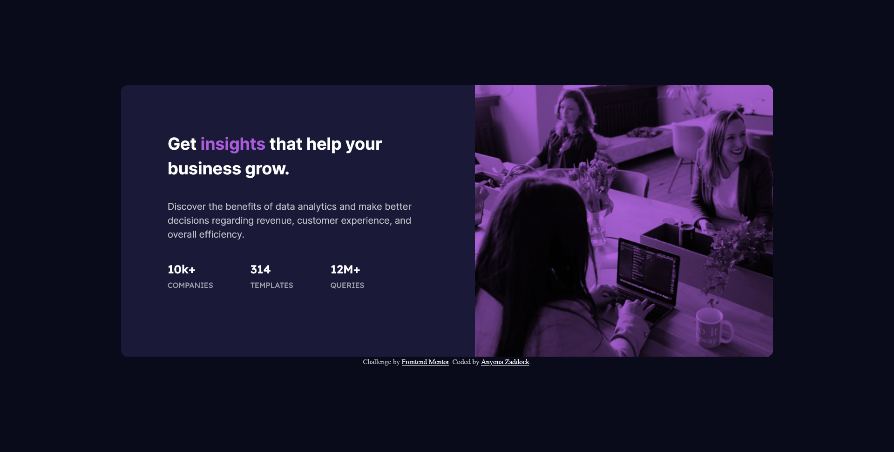

# Frontend Mentor - Stats preview card component solution

This is a solution to the [Stats preview card component challenge on Frontend Mentor](https://www.frontendmentor.io/challenges/stats-preview-card-component-8JqbgoU62). Frontend Mentor challenges help you improve your coding skills by building realistic projects. 

## Table of contents

- [Overview](#overview)
  - [The challenge](#the-challenge)
  - [Screenshot](#screenshot)
  - [Links](#links)
- [My process](#my-process)
  - [Built with](#built-with)
- [Author](#author)
- [Acknowledgments](#acknowledgments)

## Overview
  This challenge is biginner-level friendly to those getting started in building a web page to a given design. 
  Provides a good challenge to your CSS skills by getting you out of your comfort zone.
### The challenge

Users should be able to:

- View the optimal layout depending on their device's screen size

### Screenshot

### Links

- Solution URL: [GITHUB](https://github.com/zacc-anyona/stats-preview-card-Challenge-by-Frontend-Mentor)
- Live Site URL: [View using NETLIFY](https://your-live-site-url.com)
- Live Site URL: [View using VERCEL]()

## My process
  1. Understood and familiarised myself with the challenge instructions and requirements.
  2. Semantically marked up the web page content using HTML5.
  3. Styled the page using CSS utilising Mobile-first workflow.
### Built with

- Semantic HTML5 markup
- CSS custom properties
- Flexbox
- Mobile-first workflow

## Author

- Frontend Mentor - [@zacc-anyona](https://www.frontendmentor.io/profile/zacc-anyona)
- Twitter - [@anyona_zadocc](https://www.twitter.com/anyona_zadocc)

## Acknowledgments

  I want to thank myself, for taking my time, effort and discipline to complete this challenge.
  I want to thank the Frontend Mentor team for coming up with this challenge and making it accessible to everyone.

